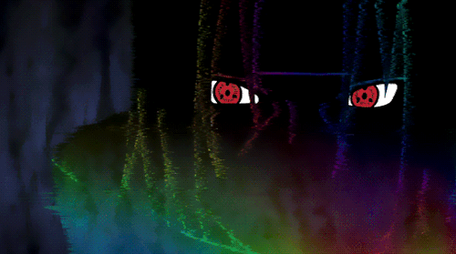

# Akatsuki_Hologram

## Objective

So the main objective of this project is to detect dynamic object using Background Subtraction method with MOG2 algorithm under it. But to make it a little innovative and fun we can add a static filter moving in the screen instead of just printing the masked area, therefore the target of this project would be to generate something as close to the one shown in the right in this section. This is a scene from the famous anime called <b>Naruto</b> that depicts a hologram with a static filter of the person instead of the person physically being there.
      

## Idea Implementation

The idea behind this project can be explained with the following steps:

* Import and  resize the static image in order to be the same size as the background being captured (i.e. 640,480 )
* Record a background in order to blend it with static image using addWeighted method
* For better efficiency we initialize MOG2() background subtractor object.
* Capture video frame by frame and read it in while loop to perform the object detection step
* Apply the initialized background subtractor object to each frame obtained to get the mask of the dynamic object.
